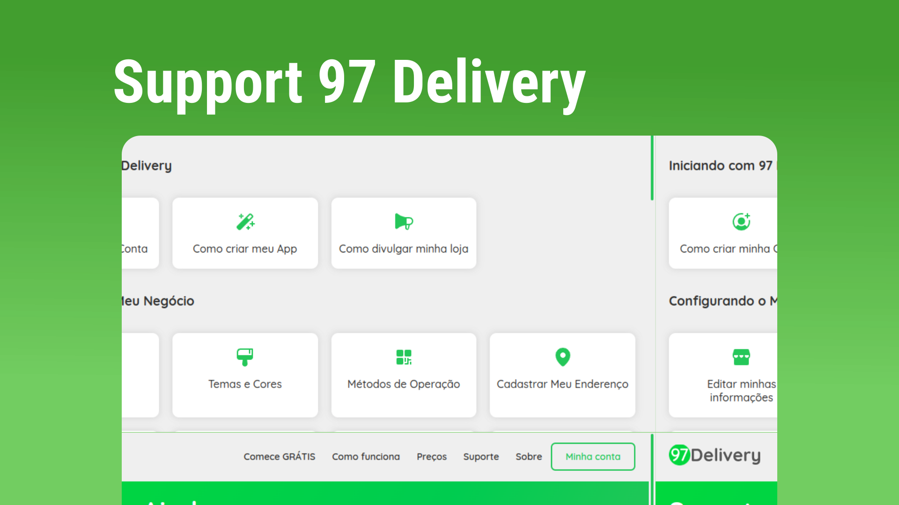

  

<h2>Site published <a href="https://support97delivery.vercel.app/">here</a></h2>

## Technologies

This project was developed with the following technologies:

<ul>
  <li>React</li>
  <li>Firebase: Firestore Database</li>
  <li>Sass</li>
  <li>Phosphor-React: Icons</li>
  <li>Typescript</li>
  <li>Vite JS</li>
</ul>

## Project

  Blog React to support a delivery app. Powered by Firebase Services

**
Personal project
**
